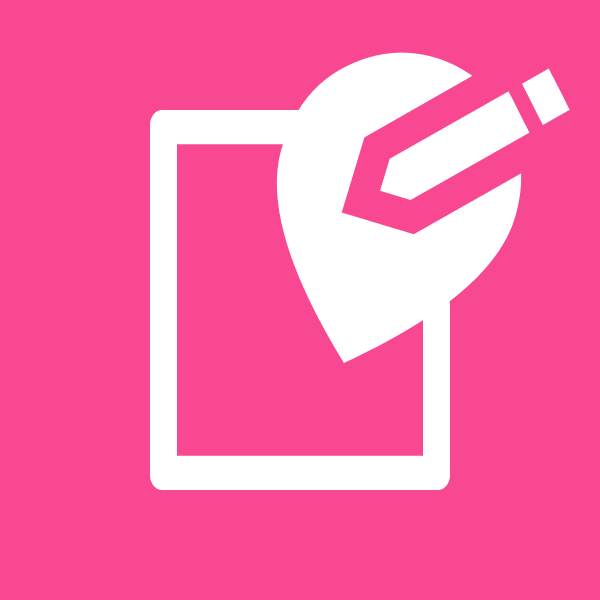

## Capstone Project - Tim C23-M4057

  
  <h3 align="center">HopePoints</h3>

This is the repository used for the capstone final project for the Program Independent Study (SIB) Kampus Merdeka x Dicoding batch-4

## Get To Know HopePoints

HopePoints is a website that provides services for women and children, supporting their rights to be free from all forms of violence.

In HopePoints, our goal is to raise awareness about violence against women and children in society. By providing comprehensive information and resources, HopePoints aims to educate the community, promote collective action, and provide support to victims and their families.

In the developed application, there are two user sides: active users and office administrators. We provide office administrators in each region to assist users in their respective areas in handling their cases.

## Our Mission

In HopePoints, our goal is to raise awareness about violence against women and children in society. By providing comprehensive information and resources, HopePoints aims to educate the community, promote collective action, and provide support to victims and their families.

## Tech Stack

<a href="https://code.visualstudio.com/">
 
   

 &nbsp
  &nbsp
  &nbsp
 
  
  &nbsp
  &nbsp

## Development

Install dependencies :  
`npm install`

Run server in development mode :  
`npm run start`

Build Production :  
`npm run build`

## Our Team

1. F133XB334 - Fakhri Raihan
2. F133XB302 - Ramji Renanda Sitorus
3. F061XB089 - Muhammad Taufik Herdyunanto
4. F165XB450 - Daffa Rizky Maulana Yusuf
